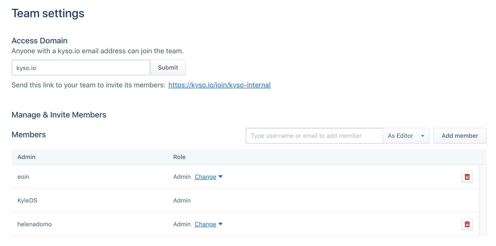

## From Airbnb’s Knowledge Repo to Kyso for Teams

*Introducing Kyso for Teams for scaling your data-driven decision-making.*

### Introduction

Knowledge management and the sharing of insights from data analysis is an evolving challenge for research and data-science teams all over the world.

In 2016, Airbnb open-sourced their [Knowledge Repository (KR)](https://github.com/airbnb/knowledge-repo), built to tackle their own needs of scaling internal knowledge sharing and management, to democratize data access for all.

The Knowledge Repo acts as a curated knowledge-sharing platform, developed with the [following aims](https://medium.com/airbnb-engineering/scaling-knowledge-at-airbnb-875d73eff091):

* Reproducibility — No code forks. The entirety of the work of each contribution should be contained in one file.
* Quality — Each contribution should be peer-reviewed prior to submission.
* Consumability — Any analysis should be understandable to all readers, both technical and non-technical.
* Discoverability — Anyone should be able to find, navigate, and stay up to date on the existing set of work on a topic.
* Learning — Other members of the team should be able to learn from the tools and techniques used by others.

Airbnb’s Knowledge Repo has been revolutionary for sharing and benefiting from data science at scale. Our team here has used it in the past for internal reporting and it sped up every aspect of our data analytics. However, we felt we could improve the overall user experience, and we wanted some additional features. The KR is what inspired us to create Kyso for Teams, to build upon and improve what Airbnb started.

### Kyso for Teams

[Kyso for Teams](https://kyso.io/) is our next-generation knowledge repo, built to enhance collaboration & reproducibility, where you can create and share your data-science notebooks (Jupyter and R), charts, analysis, datasets, code, and markdown articles.

Kyso renders everything as beautiful data blogs, perfect for academic and corporate data science teams alike. Some of the main issues of the KR that Kyso seeks to remedy are:

#### Installation & Setup

With Kyso, your team can be set up in a matter of minutes. App-based centralized access control - simply specify admin & editor access, invite unlimited readers and start posting knowledge! It’s all fully hosted on Kyso, so no need for self-hosting. No need for everyone on the team to be familiar with Git and Shell script. Of course, we do fully support Github, for teams that do use Git, which is our recommended workflow for using Kyso.

#### Workflow
On Kyso, there are multiple ways to post Knowledge:

* Directly on the web app - post charts, images, markdown files or links.
* [Connect your Github reposiories](https://docs.kyso.io/posting-to-kyso/connect-a-github-repo-to-kyso), which will render as beautiful data blogs that auto-update once synced with Kyso.
* Publish directly from Jupyterlab using our [custom extension](https://docs.kyso.io/posting-to-kyso/kysos-jupyterlab-extension).

#### Presentation and Collaboration

Presentation:

* Kyso renders all notebooks, markdown files, images, and charts as beautiful data blogs.
* For Jupyter & R notebooks, code can be hidden and shown so that posts are readable by technical and non-technical people alike.
* Searchable personal profiles of all editors.

Collaboration:

* Blog-style commenting for feedback, suggestions, and discussion.
* Team members receive email notifications when mentioned.
* To keep content current and structured, we facilitate a Reddit-esque upvoting system, which acts as an auto-indexer for research topics and posts.
* Comprehensive tagging system for organizing and discovering the work of contributors.

**Some of the additional features mentioned above include:**

#### Updating and extending analyses

Our Github integration facilitates an effortless computation-to-dissemination workflow. Once you have synced your team's repository, every commit made to Github will be refelected immediately on Kyso, so team editors can automatically update analyses or set new projects in motion much faster.

#### Facilitating for all types of teams

The KR supports 3 formats that can be converted into a knowledge post: Markdown, R Markdown, and Jupyter Notebooks.
At Kyso we have extended that to include images, datasets, links, and code. For those who don't use GitHub at all, Kyso's web-app is easy to use for uploading or creating, and sharing, posts.

### Integrate Kyso into your existing workflow

We've made it super simple to transition from your current data science workflow using Airbnb's knowledge repo to Kyso. [You can auto-import an existing knowledge-repository easily](https://docs.kyso.io/integrations/airbnbs-knowledge-repo) by leveraging our Github integration, so your team can effortlessly set up your knowledge center and use Kyso without changing the way you work.

Continue using the Knowledge Repo for Github's pull request workflow and version control, and use Kyso to present and collaborate on your work among your team. In this way, you can reap the benefits of having both an awesome presentation and collaboration format with Kyso, built on a central repository of high-quality research trusted by everyone.