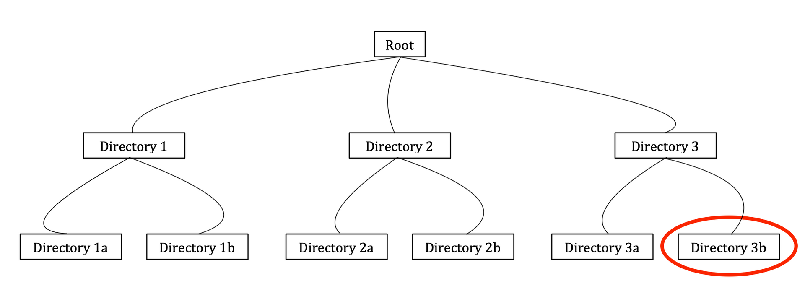

## Kyso's Jupyterlab Extension

__Note__ this plugin is installed already when you run a workspace on Kyso. So you can skip to the usage section of this page.

### Installation

Kyso has recently launched a new Jupyterlab extenstion, which enables users to publish their notebooks to Kyso directly from within Jupyterlab, whether they are actually on Kyso's cluster, using any cloud hosting service such as AWS or GCP, or simply working from their local machine. For information on the extension's prerequisites and installation, take a look at our [documentation](https://github.com/kyso-io/jupyterlab-extension) on Github.

To install the extension, run the following.

For Jupyter Lab 0.35:

`jupyter labextension install @kyso/jupyterlab
`

For Jupyter Lab 0.34:

`
jupyter labextension install @kyso/jupyterlab@jupyterlab-0.34.9
`

Note that this install requires node 5 or later. If you encounter any issues such as ValueError: Please install nodejs 5+ and npm before continuing installation when installing the above run the following & then install the extension:

```
sudo apt-get install nodejs -y
sudo apt-get install npm -y
```

Once installed, refresh the page & you will see the *Kyso* option in the top navbar.

### Usage

When you are in Jupyterlab click *Kyso* in the top-left of the navigation bar. From there you can:

 - Publish your current project to Kyso
 - Download a post from Kyso (if you are logged into a team you can pull in a post from your team's account)
 - Open up your Kyso dashboard

Note that only those notebooks and files within the current directory when you hit that Publish button will be attached to the rendered file on Kyso's frontend. Think of a Kyso publication as similar to a single folder within a Github repository, with the attached data and files accessible within our file browser. The main file can be anything you wish.

To ensure the most efficient publishing process, only those notebooks and files within the **current directory** when you hit that Publish button will be attached to the rendered notebook on Kyso's frontend. Think of a Kyso publication as similar to a single folder within a Github repository, with the attached data and files accessible within a hidden file browser.

There are 2 reasons for this:

1. Firstly, it ensures quick load times when publishing. If you have everything in the one root directory including, say, your installed dependencies, that may mean publishing a folder easily in excess of 100MB.

2. Secondly, this structure encourages only publishing the files and data that are pertinent to the rendered notebook, which also simplifies the reproducibility of your study for other users.

Let's visualise the directory structure:



We are in Directory 3b above. So when we hit Publish to Kyso, only the notebooks and other files within this directory will be published to Kyso. We will render the notebook that you select to our frontend. If there is any confusion in relation to the above, please don't hesitate to send us your questions to support@kyso.io.

***

I've drawn up some beginner guides on firing up Jupyterlab on some of the most popular cloud-service providers, so you can concentrate on just publishing to Kyso!

* AWS: https://kyso.io/KyleOS/aws-jupyterlab
* GCP: https://kyso.io/KyleOS/gcp-jupyterlab
* Digital Ocean: https://kyso.io/KyleOS/digitalocean-jupyterlab
* Azure: https://kyso.io/KyleOS/azure-jupyterlab