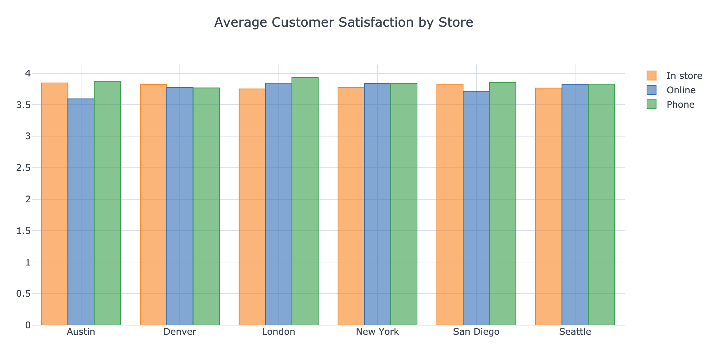
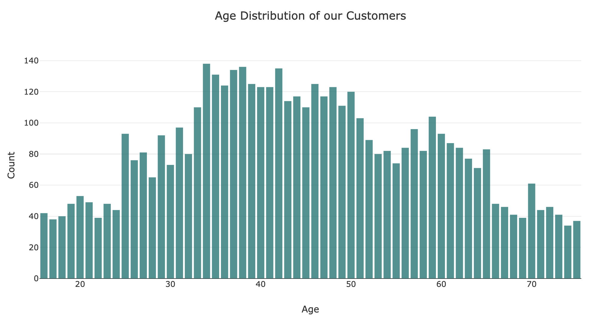
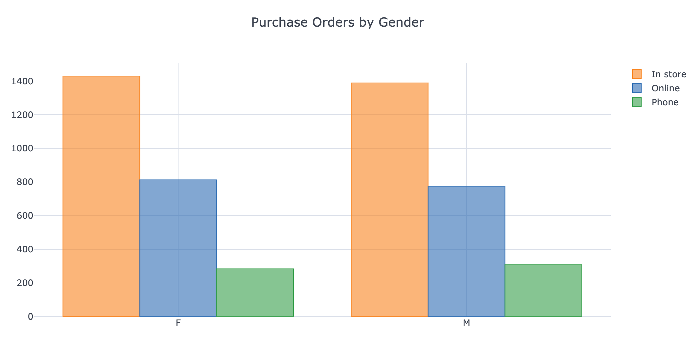
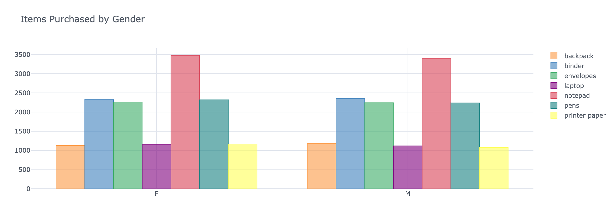
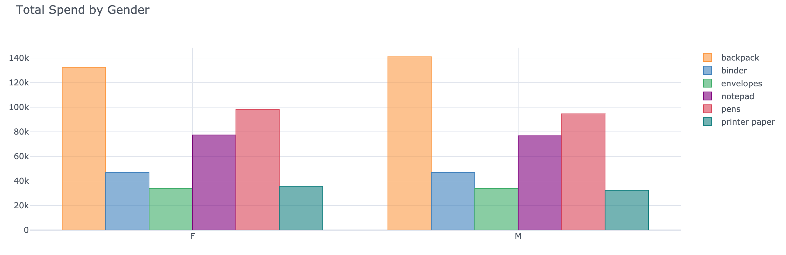

Flexible, NoSQL databases, which can handle large amounts of unstructured data and can flexibly increase or reduce storage capacity without loss, will gradually displace relational databases. MongoDB is one of the top picks among NoSQL databases in terms of fulfilling business requirements on fast and flexible access to data in multiple phases of development, especially where live data prevails.

One issue that a lot of companies face, particularly smaller companies and startups with an undeveloped data team, is visualising their data sitting on their database so they can take actionble insights. 

This guide will walk you through how to connect to your own MongoDB instance from a Jupyter notebook, pull in your data and plot it, all with python. It is assumed that you already have a MongoDB database running on Atlas.

## Getting Started

### Set Up Your Environment

Under *Clusters* on MongoDB click *Connect* on the database in question. There are 3 different ways to connect to the database. If you haven't already you'll need to whitelist your own IP address and create a MongoDB user for this specific project.

Choose the second option - *Connect your application*. Choose Python as your driver and *3.6 or later* as your version. Copy the connection string to the clipboard.

Open your bash profile in your preferred editor and enter the following:

```
    export 'MONGO_URI' = "YOUR_CONNECTION_STRING"
```

replacing "YOUR_CONNECTION_STRING" with the connection string you just copied. Within the connection string you'll also have to replace with your login password for the current user.

From the command line, run:

```
    source ~/.bash_profile
```

### Install Anaconda

Now, for this guide to be portable & runnable on any machine I first need to create a virtual environment. Check out our previous guide on installing the Anaconda distribution:

https://docs.kyso.io/guides/jupyter-with-anaconda


### Creata A Virtual Environment

We'll run the following commands to create a python3.7 environment. To create our virtual environment:

```
    conda create -n mongodb-playground python=3.7 -y
```

and start it:

```
    conda activate mongodb-playground
```

We'll also need the following libraries to connect to Mongo 4.0:

```
    conda install pymongo==3.8 dnspython ipykernel -y
```

The next command ensures that our Jupyterlab instance connects to this virtual environment:

```
    python -m ipykernel install --user
```

## Additional Installs

Later on, once we have pulled in our data, we are going to want to graph it. We usually recommend using plotly in python, given its relatively simple syntax and interactivity.

For use in JupyterLab, we need to install the jupyterlab and ipywidgets packages:

```
    conda install -c conda-forge jupyterlab-plotly-extension -y
```

Plotly has a wrapper for pandas (data manipulation library) called *Cufflinks*.

The following two commands will get you up and running:

```
    conda install -c plotly plotly
    conda install -c conda-forge cufflinks-py
```

Now we can spin up Jupyterlab with:

```
    jupyter-lab
```

On launch, you might be a prompt for a recommended build - the jupyterlab-plotly-extension install we ran above. Click Build and wait for it to be completed.

## Setting Up Our System

### Connecting To MongoDB

Let's first import our required libraries:

```
    import os # to create an interface with our operating system
    import sys # information on how our code is interacting with the host system
    import pymongo # Python distribution for working with the MongoDB API
```

Then we connect to our MongoDB client:

```
    client = pymongo.MongoClient(os.environ['MONGO_URI'])
```

note that we can call 'MONGO_URI'because we've set the the connection string as an environment variable in our ~/.bash_profile .

## Accessing Our Data

Now let's access a database, in this case, sample supplies.

```
    db = client.sample_supplies
```

A collection is a group of documents stored in a MongoDB database, roughly the equivalent of a table in a relational database. Getting a collection works the same as accessing a database like we did above. In this case, our collection is called sales.

```
    collection = db.sales
```

Let's test if we were successful by getting a single document. The following method returns a single document matching our query.

```
    test = collection.find_one()
```

## Loading Our Data Into Pandas

[Pandas](https://pandas.pydata.org/) provides fast, flexible, and expressive data structures designed to make working with “relational” or “labeled” data both easy and intuitive, and is arguably the most powerful and flexible open source data analysis / manipulation tool available.

We can convert our entire collection of data into a pandas DataFrame with a single command:

```
    data = pd.DataFrame(list(db.sales.find()))
```

## Plotting Our Data

Ok, let's start plotting our data to answer some basic questions. First, we'll import our plotting libraries.

```
    import plotly.offline as py
    import plotly.graph_objs as go
    from cufflinks import tools
    
    py.init_notebook_mode(connected=False)
    
    import cufflinks as cf
    cf.set_config_file(offline=True)
```

Documentation for the two libraries are below:

> [plotly](https://plot.ly/python/)

> [cufflinks](https://plot.ly/python/v3/ipython-notebooks/cufflinks/)

### Let's Define Our Business Questions

What business questions do you want to answer? We've laid out some example questions for our sample data:

1. What is the average customer satisfaction rating by store - and is this affected by the method of purchase, whether it's carried out over the phone, in store or online?

```
    df.groupby(['storeLocation', 'purchaseMethod'], as_index=True)['satisfaction'].mean().unstack().iplot(
    kind='bar', mode='group', title='Average Customer Satisfaction by Store')
```



2. What is the age distribution of all of our customers?

```
    df['age'].iplot(kind='hist', color='rgb(12, 128, 128)', opacity=0.75, bargap = 0.20,
               title="Age Distribution of our Customers", xTitle='Age', yTitle='Count')
```



3. What were the number of purchase orders received, broken down by gender - are there any major differences?

```
    df.groupby(['gender', 'purchaseMethod'], as_index=True)['_id'].count().unstack().iplot(
    kind='bar', mode='group', title='Purchase Orders by Gender')
```



4. How many items were purchased by men and women?

```
    df.rename(columns={'items':'item'}, inplace=True)
    df = (df.groupby(['_id', 'gender', 'age'])['item']
                .apply(lambda x: pd.DataFrame(x.iloc[0], columns=['name', 'tags', 'price', 'quantity']))
                .reset_index())
    df["price"] = df.price.astype(str).astype(float)

    df.groupby(['gender', 'name'], as_index=True)['gender'].count().unstack().reset_index(
                ).fillna(0.0).set_index('gender').iplot(kind='bar',mode='group',title='Items Purchased by Gender')
```



5. What was the total spend on each item?

```
    df.groupby(['gender', 'name'], as_index=True)['price'].sum().unstack().drop(
    'laptop',axis=1).iplot(kind='bar',title='Total Spend by Gender')
```



Ok, so we've answered some basic questions about our business metrics. It's time to post this notebook to our team's Kyso workspace so everyone can learn from our insights and apply them to their respective roles.

- We can push to our organisation's Github repository from our local machine and sync this repo with Kyso. Simply follow the guide linked below:

https://docs.kyso.io/posting-to-kyso/connect-a-github-repo-to-kyso

And there you have it! Use this template to connect to your own database and communicate data insights to the wider company so everyone can benefit from this previously siloed knowledge.