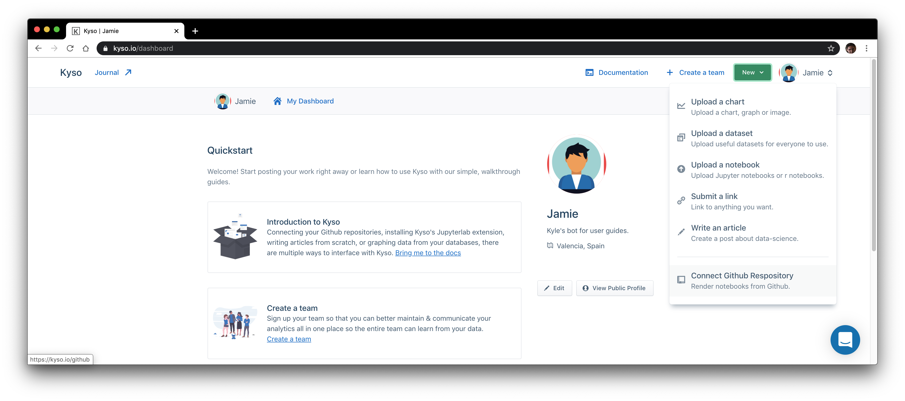
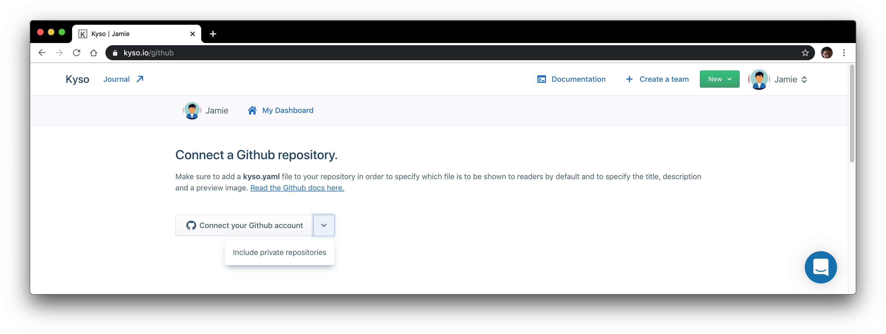

Sharing and reproducing data insights is still not easy. Most companies still do not have a central hub for knowledge management. Internal data teams use tools like Github for project management, access to which is typically restricted to the data scientists & engineers. This means their work is not shared with the non-technical people in the company. They use technical documents like data science notebooks for data exploration & analysis, but the presence of code, terminal output, etc. means they are not the best communication tool for non-technical audiences in their base form.

The increasing number of people working remotely also means that a lot of us are not able to just pop over to a colleague in the office to discuss a graph or sit in on a business meeting about the latest analytics report. All of this causes a lot of locked business value because not everyone in the company learns from generated insights - it is important that business teams & executives, the marketing and sales guys, and other non-technical teams are all learning from your data.

What is needed is an effective medium that allows the technical team to continue using their existing workflow, but simplifies the communication process and facilitates better discoverability of analyses for all relevant parties.

Kyso solves this problem with our Github integration and an elegant blogging platform for rendering data science notebooks, making accessible to everyone information that was previously only possessed by a select few. Kyso lets technical teams publish and share their analyses in a more readable format by rendering notebooks as web articles. Think of it like your team's own internal [Medium](http://medium.com), but for data science — you can publish Jupyter & R notebooks. Any code is hidden by default and can be toggled so that your post is digestible for both technical and non-technical audiences alike. You can also write articles from scratch using our in-app Markdown editor.

We created Kyso to optimize the computation-to-communication workflow of internal data teams and other practitioners of scientific computing, from the exploratory phase of their work to the communication of the results. In this article, I’ll go through how to do just that, for both your personal & professional projects.

## The Workflow

### Getting Started

If you don't yet have an account, head over to [Kyso](https://kyso.io) and sign up — it’s free a personal account! If you like you can sign up with your Github account, which will automatically sync to Kyso.

Then, on your dashboard, navigate to our *Github* page.

### Authorisation

If you did sign up to Kyso with Github you will be automatically connected and you should see all your public repositories on this page. If not, just click the Connect Github Account button. Using the dropdown on the right you have the option to authorize all your Github repositories, or just your public ones (default). It's not possible to authorize just one repository at this time given the way Github’s OAuth authorization works.

On the Github OAuth page, you will have the option to authorize your own account and any organizations you may be a part of. You can search and filter your repositories, and import them to Kyso by clicking *Connect to Kyso*. You can then browse these posts on your Kyso dashboard.

Remember that, while a post on Kyso may look like a single rendered notebook, it is, in fact, a reflection of a complete Github repository (or a sub-directory of a Github repository), meaning you can browse all attached files on Kyso. If your repository contains many different folders which would be better presented as different posts on Kyso, this is also possible.

Check out our [documentation](https://docs.kyso.io/connect-a-github-repo-to-kyso) to see how the configuration works.

## Conclusion

And there you have it! You can continue to operate within your existing workflow, using Jupyter notebooks for data exploration, machine learning, etc., pushing your commits to Github so your project's history is maintained. All commits will be automatically reflected on Kyso sister posts in a readable format.

For a working example of how Kyso’s Github integration can work with your notebooks, check out this Github repository for various [data analysis projects](https://github.com/JJamie89/Data-Analysis). You’ll see a lot of sub-directories there which I have set as separate posts on Kyso. Check out our [documentation](https://docs.kyso.io/connect-a-github-repo-to-kyso) for our configuration guidelines. 

Finally, head over to [Jamie's Kyso profile](https://kyso.io/Jamie) to view how these posts render beautifully. Kyso’s Github integration can also be leveraged for internal private knowledge sharing, to use Kyso to present and collaborate on your analyses among your team. All team members will be able to consume, search & provide feedback with blog-style commenting on posted content. 

Jupyter notebooks and similar tools are [becoming the new Excel](https://towardsdatascience.com/jupyter-is-the-new-excel-a7a22f2fc13a). In order to reap the full benefit of this phenomenon, the knowledge within these documents needs to be communicated effectively across entire organizations, so everyone - I mean everyone - can learn & apply data insights to their respective roles to drive business value. At Kyso we want to help you do just that.