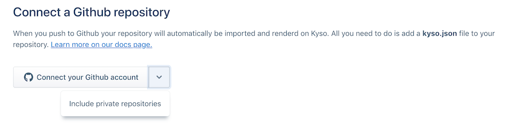

## Importing your Knowledge Repo to Kyso

We've made it super simple to transition from your current data science workflow using Airbnb's knowledge repo to Kyso through our Github integration. You can even continue using the knowledge repo if you like and use Kyso to present and collaborate on your posts among your team. If you are unfamiliar with our [Github integration](connect-github/Readme.md) a brief recap. You can also create many Kyso posts from one Github repo as outlined in the Github integration documentation page.

Click on the **New** button in the navigation bar at the top and select Connect Github Repository.

Connect your Github account - you can click the arrow to the left to also include your private repositories. On the next Page you will see a list of all your Github repositories. Your team's knowledge repo will also show up here just like any other repository on Github. Select it to connect. You can then *View on Kyso*. You will see that we create a main post of the knowledge repo itself.

**Important:** We identify the knowledge repo by the existence of a `.knowledge_repo_config.yml` file in the knowledge repo itself, so it is important that you do not delete this file. We then read in the knowledge.md file as the main file to render on the main post. You can browse through the files and select different files to render.

Each .kp directory within the knowledge repo is published to Kyso as a separate post. Again, the knowledge.md file created from the source file will rendered as the main file on Kyso, and all other files within the specific .kp folder are attached. Unlike when connecting a regular Github repo, there is no need to specify a main file to render in a kyso.json file.

**Important:** Note also that if you delete the main knowledge repository then all the child posts synced to Kyso (i.e. the .kp folders) will be deleted too.

For your workflow, any commits you push to the Github repo will be automatically reflected on Kyso.
