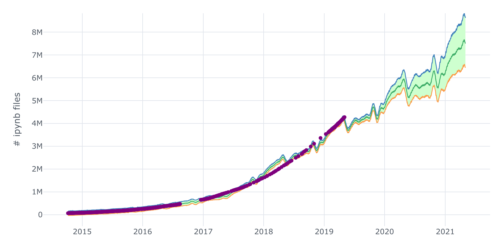

## Kyso - A Platform for Data-Driven Decisions

### The Problem

Knowledge management and the sharing of insights from data analysis is an evolving challenge for data science teams all over the world. More and more organizations are investing in tools designed to mature their analytical capabilities. However, a peristant issue is that data scientists often struggle to make generated insights widely available within the business since the tools they use (notebooks, Github, etc.) are only used by technical members of the team. 

There is no quality data reporting tool for technical anlayses that could make every business decision data-driven. 

The most important thing you can do if you want to be a data-driven company is to make data insights accessible to everyone in your organization. Your data science teams shouldn’t be responsible for providing the interface that demonstrates the knowledge gained. They should be able to simply focus on data procurement and the analysis itself, rather than tool-builders. 

To be truly data-driven, you have to empower people to use a self-service model with data. Everyone in your organization should be encouraged to use data when making decisions in their respective roles. Every single position within a company benefits from data - but there just isn't sufficient tooling available.

This is such a huge issue that huge companies like Airbnb, Stripe and Netflix have built their own internal solutions:

- Stripe: [https://stripe.com/en-es/blog/reproducible-research](https://stripe.com/en-es/blog/reproducible-research)
- Airbnb: [https://medium.com/airbnb-engineering/scaling-knowledge-at-airbnb-875d73eff091](https://medium.comairbnb-engineeringscaling-knowledge-at-airbnb-875d73eff091)
- Netlix: [https://medium.com/netflix-techblog/notebook-innovation-591ee3221233](https://medium.com/netflix-techblog/notebook-innovation-591ee3221233)

### Existing Tools

**Business Intelligence (BI) Tools**

BI tools like [Tableau](https://www.tableau.com) and [Domo](https://www.domo.com/) are great for making visualisations but are generally extremely limited for use cases like combining multiple data sources, cleaning and transforming data, complicated calculations, and modelling and custom graphics across multiple formats. Eveen the data that these tools consume needs to be strcutured before they can render the analytics.

**General Knowledge Hubs**

Platforms like [Notion](https://www.crunchbase.com/organization/sugarbox) and [Confluence](https://confluence.atlassian.com) are, in a sense, similar to Kyso in that they help spread knowledge across the company but they are not compatible with the technical tools that data scientists typcially use. 

**Runnable Notebooks**

There are large products that allow data engineers and scientists to run and share notebooks in the cloud, like [AWS Sagemaker](https://aws.amazon.com/sagemaker/), [Floydhub](https://www.floydhub.com/) and [Google Colab](https://colab.research.google.com/), but they focus more on the compute side of data science, are tool specific and are not accessible to non-technical people.

### Our Solution

Kyso is a central knowledge hub where data scientists can post reports so everyone on the team can read and learn from them. Kyso is compatible with data science tools like Jupyter notebooks and thus bridges the gap between the data science team and the rest of the company. [Jupyter notebooks](https://jupyter.org) and [R-markdown](https://rmarkdown.rstudio.com/) notebooks are by far the two most popular types of data science notebooks. They are open-source formats created by the community, but currently cannot be shared seamlessly. There are over 5-million Jupyter notebooks on Github alone (y-axis on this graph is the number of notebooks), and there is clear exponential growth in usage:

The Jupyter Notebook is an open-source web application that allows you to create and share documents that contain live code, equations, visualizations, and narrative text. Uses include data cleaning and transformation, numerical simulation, statistical modeling, data visualization, machine learning, and much more.

Many people think Jupyter is the next Excel: 

- [https://towardsdatascience.com/jupyter-is-the-new-excel-but-not-for-your-boss-d24340ebf314](https://towardsdatascience.com/jupyter-is-the-new-excel-but-not-for-your-boss-d24340ebf314)
- [https://towardsdatascience.com/jupyter-is-the-new-excel-a7a22f2fc13a](https://towardsdatascience.com/jupyter-is-the-new-excel-a7a22f2fc13a)

Data tools like Jupyter notebooks are most often used to generate some kind of exploratory analysis report. The most common way to share results from these sorts of studies is to compose an email and attach some graphs. But Kyso renders these documents automatically as beautiful data blogs, in a way that a non-technical audience can read. At Kyso we want to enable people to write reports that will satisfy any questions that come up.

We’re aligning incentives between the data scientists (anybody who wants to write a report) and the rest of the company, the non-technical (anyone who can apply the analysis to their respective roles within the company). This kind of sharing is great for our organization because it means we can get way more depth than we ever could have in an email or a meeting. That kind of detail about things like where we have financial losses with our partners allows the engineers to implement exactly the solutions that are suggested in the report.

### Conclusion

Collaborative Data Science Made Simple

Sharing is hard...

... but it doesn't have to be. Share your notebook as a work in progress or a published article. Share it with the world or in private with a select few. Your peers and readers can run your code with no setup or installation required.

This kind of sharing is great for our organization because it means we can get way more depth than we ever could have in an email or a meeting. That kind of detail about things like where we have financial losses with our partners allows the engineers to implement exactly the solutions that are suggested in the report.

VCS like Github handle the version control, knowledge management and collaboration (think Confluence for data science) and 
Think of it like Github, but specifically for data science. and we integrate with Github so that teams can deploy notebooks to Kyso automatically when they commit to Github so that they retain version control